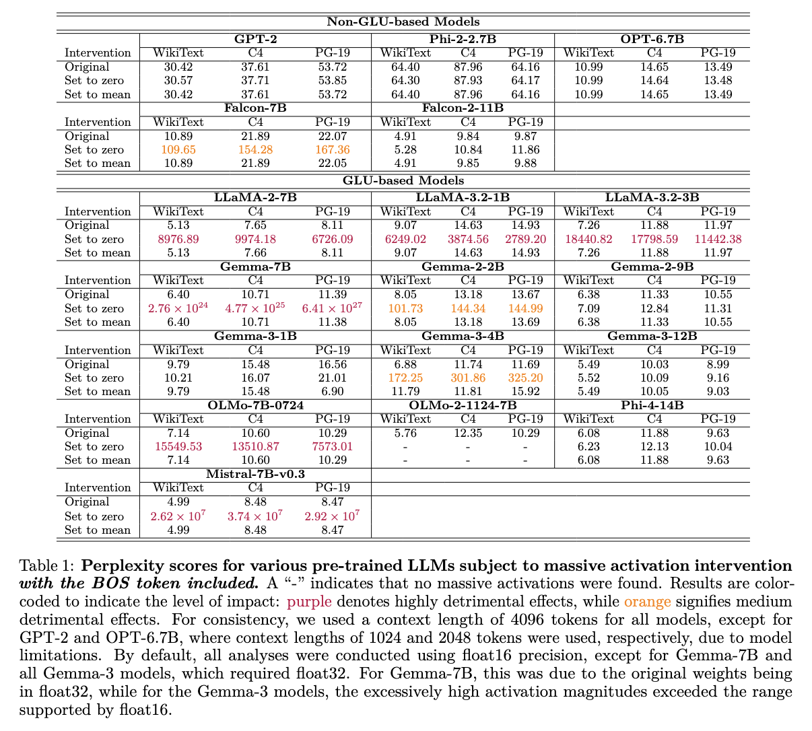

# A Refined Analysis of Massive Activations in LLMs

Official implementation of our paper:

<b>A Refined Analysis of Massive Activations in LLMs</b>

[Louis Owen](https://www.linkedin.com/in/louisowen/), [Nilabhra Roy Chowdhury](https://www.linkedin.com/in/nilabhraroychowdhury/), [Abhay Kumar](https://www.linkedin.com/in/akanyaani/), [Fabian Güra](https://www.linkedin.com/in/guera/) 

BluOrion

[Paper](#)



This paper helps address some of the gaps from previous analysis on [Massive Activation](https://arxiv.org/abs/2402.17762) by conducting an analysis across a broad range of LLMs, including both GLU-based and non-GLU-based architectures. Our findings challenge several prior assumptions, most importantly: 
(1) not all massive activations are detrimental, i.e. suppressing them does not lead to an explosion of perplexity or a collapse in downstream task performance; 
(2) proposed mitigation strategies such as attention KV bias are model-specific and ineffective in certain cases. 
Furthermore, we identify several other mitigation approaches that prove effective beyond GPT-2, addressing limitations of prior work. 

## Requirements

The dependencies are listed in [requirements.txt](requirements.txt).

## Code Structure

Some part of the code are inspired by the [official implementation](https://github.com/locuslab/massive-activations) of the previous analysis on [Massive Activation](https://arxiv.org/abs/2402.17762).

* [monkey_patch](monkey_patch) contains the code for patching the attention modules of LLMs for visualization purpose.
* [mitigation](mitigation) contains the code of mitigation strategies discussed in the paper, such as attention KV Bias, Target Variance Rescaling (TVR), Dynamic Tanh (DyT).
* [utils](utils) contains the code for model loading, massive activation existence validation, tokens linked to massive activation, intervention analysis, and visualization.
* [main.py](main.py) is the entrypoint of this repo.

## Usage Guidelines

The entrypoint of this repo is from `main.py` that has the following arguments options.
```
options:
  -h, --help            show this help message and exit
  --exp_type EXP_TYPE   Type of experiment to run
  --pretrained PRETRAINED
                        Path to the pretrained model
  --module_name MODULE_NAME
                        Name of the module in the layer
  --layer_path LAYER_PATH
                        Path to the decoder layers in the model. GPT-2 uses `transformer.h`
  --attn_path ATTN_PATH
                        Path to the attention layers in the model. GPT-2 uses `attn`
  --show_logits SHOW_LOGITS
                        Whether to show logits in the self-attention plot
  --dtype DTYPE         Data type to use
  --add_bos_token ADD_BOS_TOKEN
                        Whether to add a BOS token
  --context_length CONTEXT_LENGTH
                        Context length
  --sentence SENTENCE   Sentence to use for the visualization.
  --save_dir SAVE_DIR   Directory to save outputs
  --seed SEED           Random seed
  --device DEVICE       Device to use
```

The following are the valid options for the `exp_type` args:
* `existence_validation`: experiment to validate the existence of massive activation.
* `tokens_analysis`: analysis on what tokens are linked with the massive activations. You can see the summary at the end of the generated text file or in your stdout.
* `intervention_analysis`: the intervention analysis experiment to check the detrimental magnitude of a given LLM.
* `top_activation_magnitude`: to visualize the top activation magnitude across layers.
* `self_attention`: to visualize the self attention concentration phenomenon.


## Figures

Relevant figures for other massive activation characteristics that we observed in all pretrained LLMs studied in the paper are presented in the [figures](figures) folder.

## Citation
```

```
